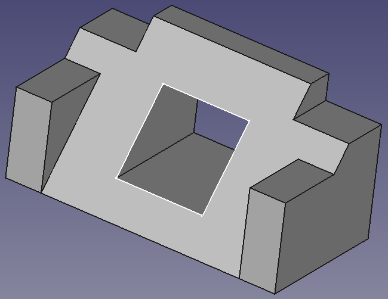
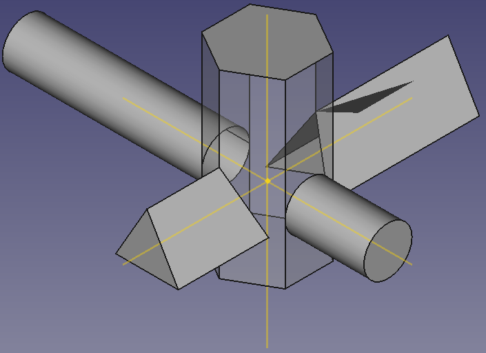
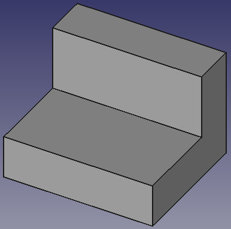
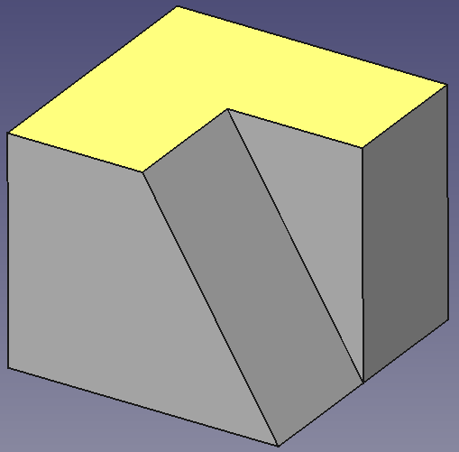
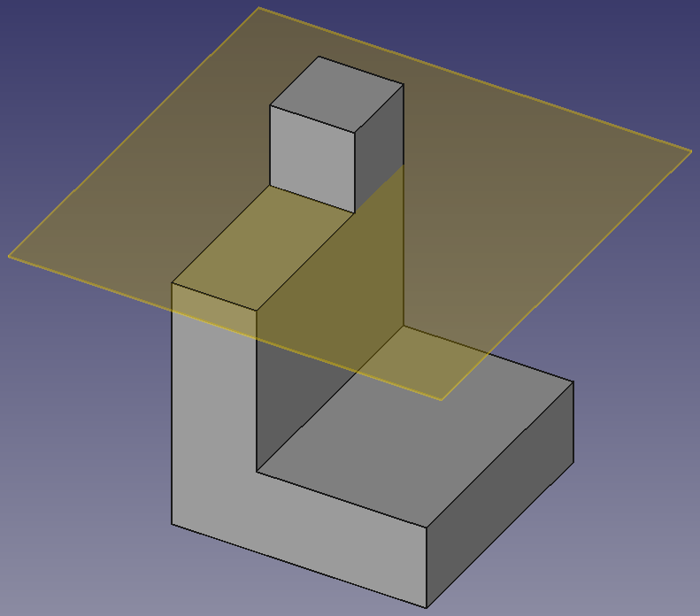

# Ficheros fuente diseñados con FreeCAD 0.18 / 0.19 y exportaciones

Todos los archivos están disponibles para su descarga en el [repositorio](https://github.com/fgcoca/Tutoriales-FreeCAD-0.19) correspondiente o en los enlaces que se suministran para cada caso.  

| **00-Pieza de repaso** | **Imagen de la pieza** |
|---|---|
| Se trata de la pieza que aparece en el [Tutorial básico de Part Design 0.17](https://wiki.freecadweb.org/Basic_Part_Design_Tutorial_017/es) que nos sirve como introducción y repaso antes de comenzar con el nuevo banco de trabajo *Part Design*. Disponibles archivos en formato [fuente](../Ejercicios/src/00/00-Pieza-de-repaso.FCStd), [STL](../Ejercicios/stl/00.stl), [AMF](../Ejercicios/amf/00.amf) y [STEP](../Ejercicios/stp/oo.step) | |

| **01-Body planos y ejes** | **Imagen de la pieza** |
|---|---|
| Descripción de las novedades del banco de trabajo y las definiciones correspondientes, descripción de la nueva forma de crear un boceto, explicación del vector normal a un plano y de distintos tipos de extrusión. Disponibles archivos en formato [fuente](../Ejercicios/src/01/01-Body-planos%20y%20ejes.FCStd), [STL](../Ejercicios/stl/01.stl), [AMF](../Ejercicios/amf/01.amf) y [STEP](../Ejercicios/stp/01.step) | |

| **02-F1-1-Pieza modelo** | **Imagen de la pieza** |
|---|---|
| Se trata de la [pieza número 1/Ficha 1](../Ejercicios/Fichas-referencia/ficha1.pdf) necesaria para poder trabajar en este tema. Disponibles archivos en formato [fuente](../Ejercicios/src/02/02-Creacion-vistas-pieza.FCStd), [STL](../Ejercicios/stl/02.stl), [AMF](../Ejercicios/amf/02.amf) y [STEP](../Ejercicios/stp/02.step) |  |

| **03-F1-4-Plano que pasa por tres puntos** | **Imagen de la pieza** |
|---|---|
|Se trata de la [pieza número 4/Ficha 1](../Ejercicios/Fichas-referencia/ficha1.pdf) necesaria para poder trabajar en este tema. Disponibles archivos en formato [fuente](../Ejercicios/src/03/03-plano-tres-puntos.FCStd), [STL](../Ejercicios/stl/03.stl), [AMF](../Ejercicios/amf/03.amf) y [STEP](../Ejercicios/stp/03.step)| |'''

| **04-F1-3- Plano de referencia fijado a objetos** | **Imagen de la pieza** |
|---|---|
|Para la explicación de la creación de planos de referencia fijados a los objetos denominados Plano XY, Plano XZ y Plano ZY utilizaremos la pieza número 3 de la [ficha 1](../Ejercicios/Fichas-referencia/ficha1.pdf). Disponibles archivos en formato [fuente](../Ejercicios/src/04/04-Plano-fijado-a-plano-referencia.FCStd), [STL](../Ejercicios/stl/04.stl), [AMF](../Ejercicios/amf/04.amf) y [STEP](../Ejercicios/stp/04.step)| |'''

| **xx-** | **Imagen de la pieza** |
|---|---|
|. Disponibles archivos en formato [fuente](), [STL](), [AMF]() y [STEP]()| |'''

