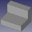

# Relación de archivos

| Aspecto | STL | AMF | Descripción |
|:-:|---|---|---|
|  |[F1-1.stl](../Ejercicios/stl/F1-1.stl) |[F1-1.amf](../Ejercicios/amf/F1-1.amf) | Sólido de referencia paradesarrollar el tutorial 2 |
|  | | | |
|  | | | |
|  | | | |