# Body en PartDesign
## Definiciones  
A partir de la versión 0.17 de FreeCAD para trabajar con bocetos es necesario que exista al menos un cuerpo o body, veamos el concepto de cuerpo en que consiste:  

*Un cuerpo PartDesign está diseñado para modelar un solo sólido contiguo. El significado de "contiguo" hace referencia a un elemento hecho en una sola pieza, sin partes móviles o sólidos desconectados. Ejemplos de sólidos contiguos son una tuerca, una arandela y un tornillo (imagen 1.1) en que cada uno es una sola pieza sólida sin partes móviles, por lo que cada uno puede ser modelado por un cuerpo PartDesign.    
Una vez que estos sólidos contiguos se unen en algún tipo de disposición, se convierten en un "ensamblaje", como se observa en la imagen 1.2. En un ensamblaje, los objetos no se fusionan, sino que simplemente se "apilan" o se colocan uno al lado del otro, y siguen siendo partes individuales.*  

| Imagen 1.1 | Imagen 1.2 |  
|:-:|:-:|  
| 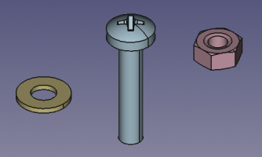 | 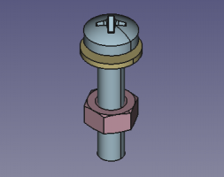 | 
| Tres sólidos contiguos individuales, cada uno de ellos modelado por un cuerpo PartDesign. | Los tres cuerpos individuales ensamblados |

Al crear un *Body* se crea un objeto *Origin* que incluye los ejes X, Y y Z, y los planos estándar que delimitan el espacio. En la imagen 2 vemos estos elementos.  

| Imagen 2.1 | Imagen 2.2 | Imagen 2.3 |    
|:-:|:-:|:-:|
| 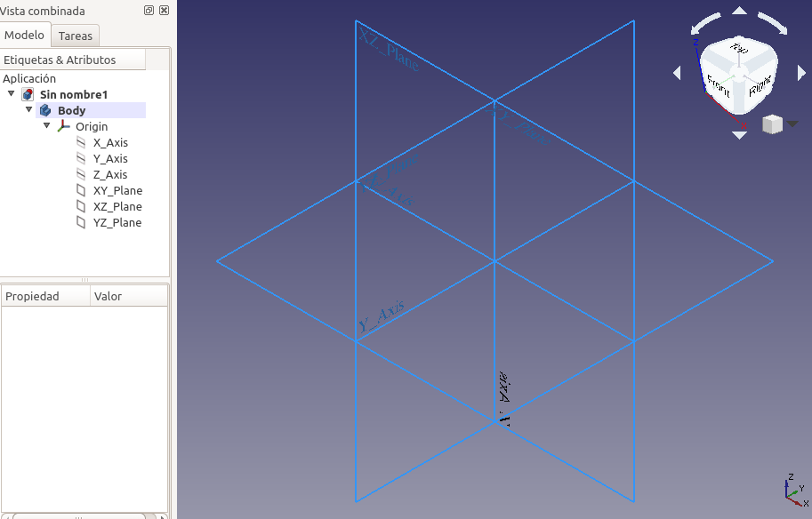 | 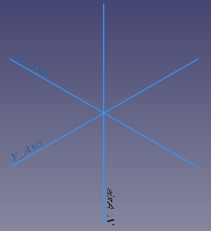 | 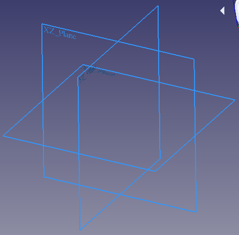 |
| Ejes y planos. | Solo los ejes.  | Solo los planos. |  

Estos elementos se pueden utilizar como referencias para bocetos y objetos primitivos.  
Cuando hablamos de un cuerpo como un sólido contiguo significa que lo podemos mover como una unidad sin variar las características individuales. Podemos crear múltiples cuerpos para poder crear ensambles. En la imagen 3 vemos el entorno inicial con una figura simple incluida.

  

| Imagen 3 | 
|:-:|  
|  | 
| Sólido, ejes y planos  |

## Creación de un boceto
Si estando en el banco de trabajo PartDesign creamos directamente un boceto se creará de forma automática un cuerpo que lo contenga. En cualquier caso se nos va a mostrar la opción de escoger en que plano queremos crear nuestro boceto, como vemos en la imagen 4, donde se ha seleccionado el plano XY.  

| Imagen 4 | 
|:-:|  
| 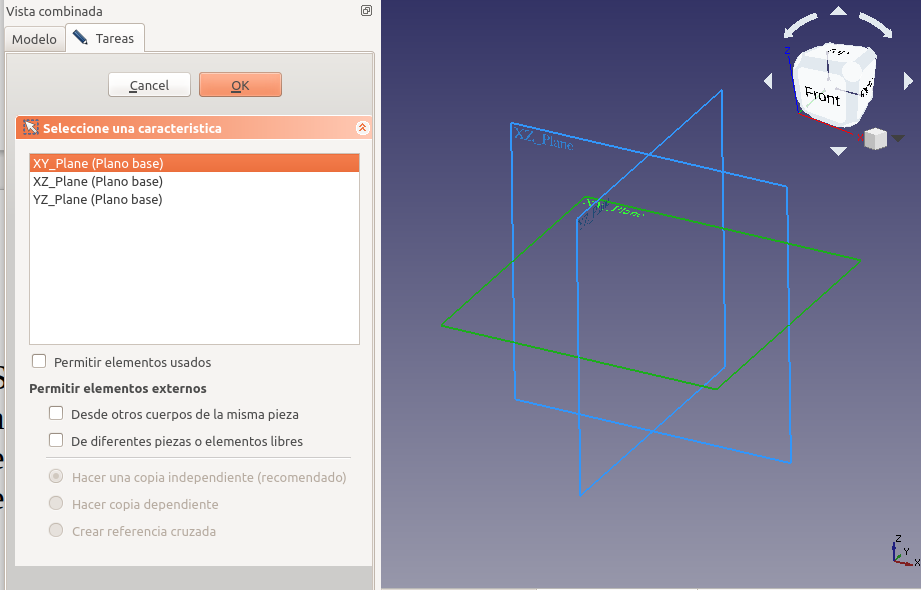 | 
| Selección de plano XY  |

Vamos a crear nuestro boceto aplicando una restricción de simetría de dos vértices diagonales respecto al origen de coordenadas y las cotas correspondientes. El tipo de restricción diagonal hace que nuestro rectángulo esté centrado al origen de coordenadas. Todas las restricciones aplicadas hacen que nuestro boceto tenga cero grados de libertad, o sea que está totalmente restringido y por ello se muestra en color verde. Se aconseja observar los grados de libertad según vamos aplicando restricciones y tratar de entender como cambian. En la imagen 5 tenemos el resultado.

| Imagen 5 | 
|:-:|  
| 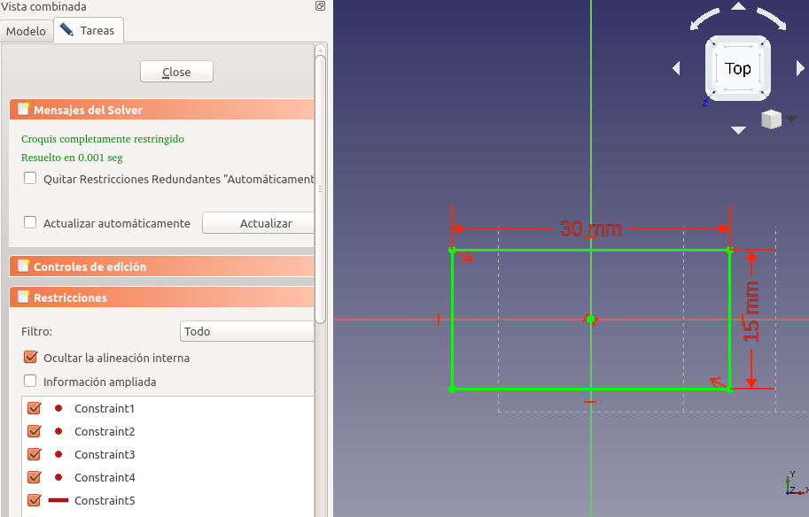 | 
| Boceto totalmente restringido  |

Ya podemos salir de la tarea y proceder a extruir nuestro boceto una determinada longitud, por ejemplo 5 cm, obteniendo el resultado que vemos en la imagen 6.

| Imagen 6 | 
|:-:|  
| 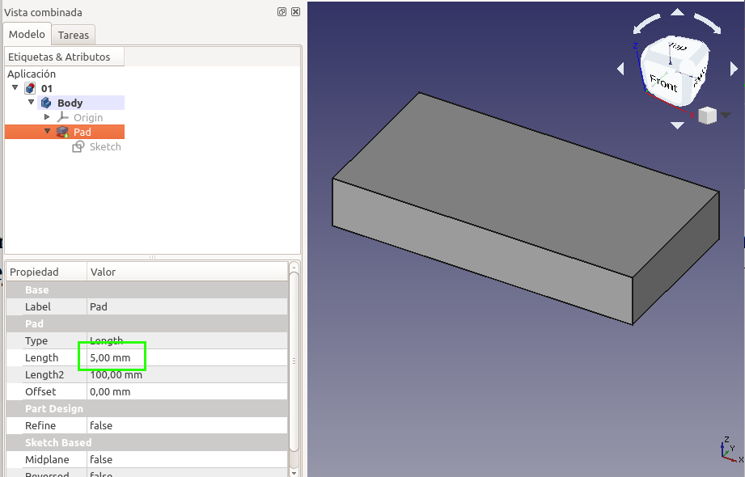 | 
| Sólido a partir de extrusión de boceto  |

## La normal de un plano
Cada plano tiene sus propios ejes de coordenadas X, Y, Z que se conocen como ejes locales y que vemos en la imagen 7.

| Imagen 7 | 
|:-:|  
| 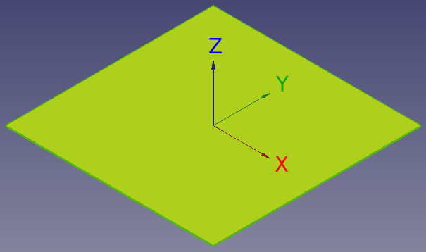 | 
| Plano y sus ejes de coordenadas locales  |

La normal a un plano es un vector perpendicular al mismo que coincide con el eje Z local. En la imagen 8 vemos representado el vector perpendicular al plano XY y se observa como coincide con el eje Z local.

| Imagen 8 | 
|:-:|  
|  | 
| Vector normal al plano XY  |

Cuando creamos un boceto FreeCAD nos sitúa en una vista en la que el vector normal al plano escogido apunta hacia nosotros, como se observa en la imagen 9, donde hemos rotado mínimamente la vista original para que se aprecie el vector normal.

| Imagen 9 | 
|:-:|  
| 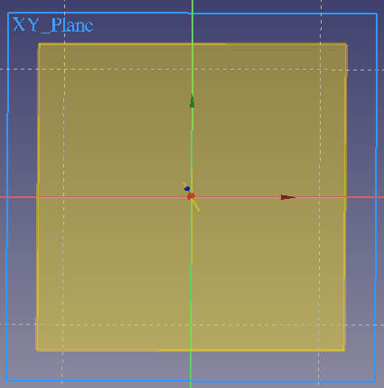 | 
| Visualización del vector normal al crear boceto   |

## Tipos de extrusión
La extrusión tipo cota de un boceto se realiza siguiendo la trayectoria del vector normal al plano y puede ser de tres formas posibles, como vemos en la imagen 10.

| Imagen 10 | Extrusión tipo cota en plano XY|
|:-:|---|  
| 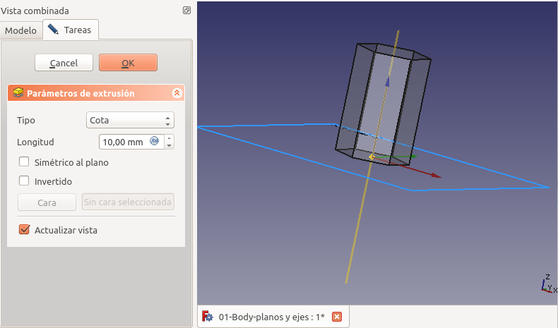 | Con valores positivos   |
| 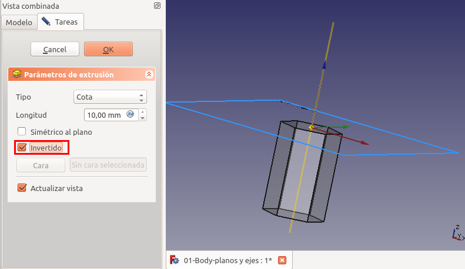 | Con valores negativos   |
| 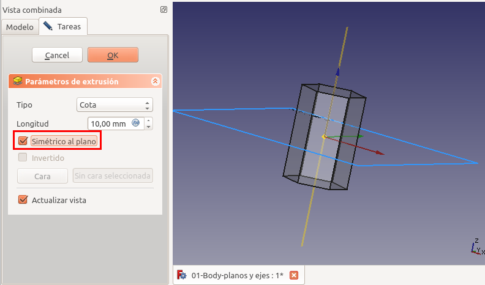 | Simétrica al plano   |

Uno de los tipos de extrusión aplicables en este ejemplo que en particular resulta útil es el de *Dos dimensiones* que vemos en la imagen 11.

| Imagen 11 | 
|:-:|  
| 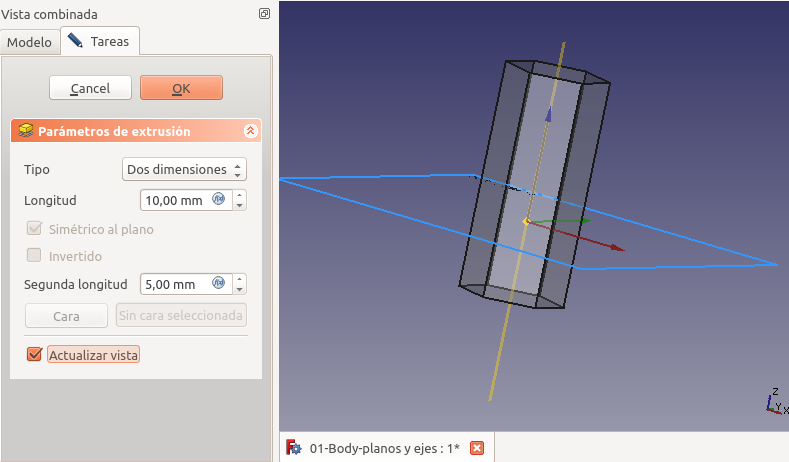 | 
| Extrusión de tipo dos dimensiones   |

Esto mismo va a ocurrir con el plano de referencia XZ y su vector normal que coincide con el eje Y, como vemos en la imagen 12 con un sólido triangular.

| Imagen 12 | Extrusión tipo cota en plano XZ|
|:-:|---|  
| 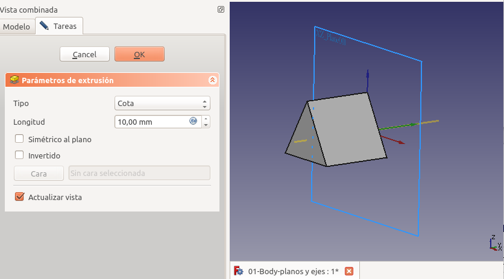 | Con valores positivos   |
|  | Con valores negativos   |
| 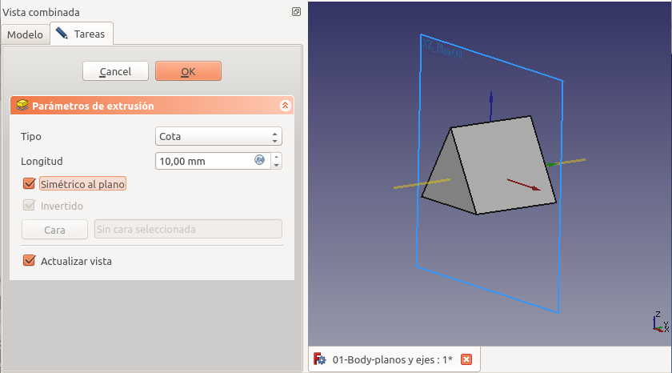 | Simétrica al plano   |
| 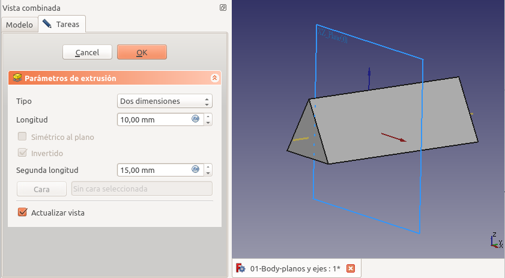 | Dos dimensiones   |

En la imagen 13 vemos el proceso repetido para el plano YZ y su vector normal, que lógicamente coincide con el eje X. En este caso usamos un cilindro como sólido.

| Imagen 13 | Extrusión tipo cota en plano YZ|
|:-:|---|  
|  | Con valores positivos   |
| 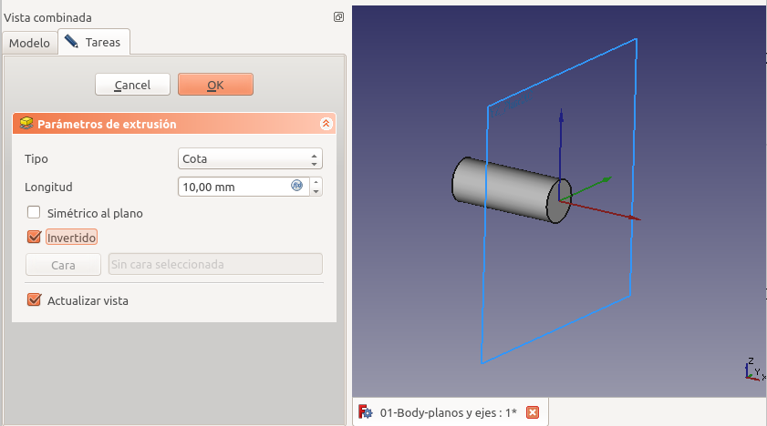 | Con valores negativos   |
| 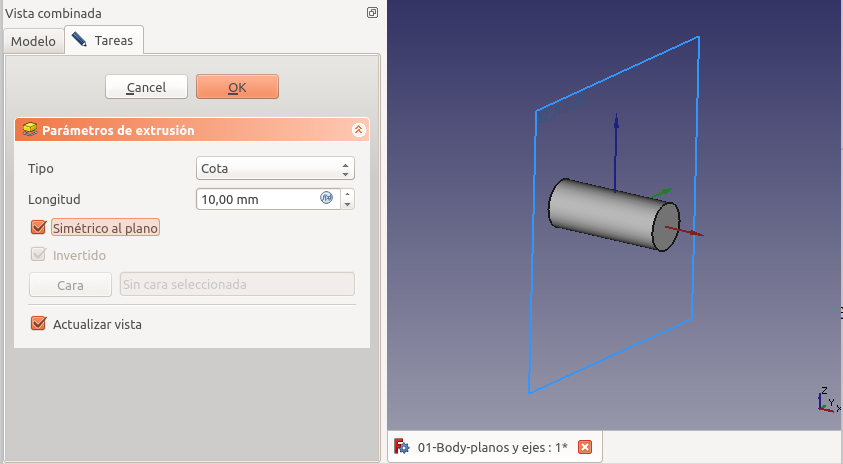 | Simétrica al plano   |
| 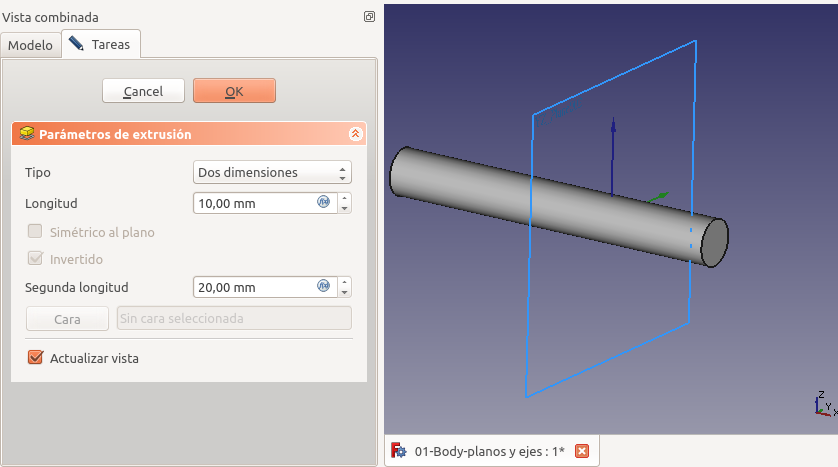 | Dos dimensiones   |

Con los tres sólidos creados podemos hacer una operación booleana de unión y obtener un modelo 3D en el que se ven los cuerpos, los planos de referencia, los vectores normales y por supuesto la cruz de ejes de referencia del sistema. En la imagen 14 lo vemos claramente.

| Imagen 14 | 
|:-:|  
| 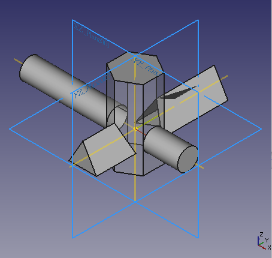 | 
| Modelo 3D resultado de la unión de tres sólidos   |

En la animación siguiente vemos el resultado final.

