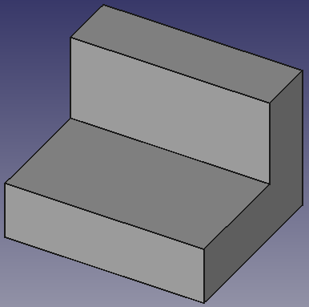

# Creación de las vistas de una pieza

## Requisitos previos

Vamos a obtener las vistas de una pieza según los criterios que establece la norma UNE 1-032-82, “Dibujos técnicos: Principios generales de representación”. Esta norma es equivalente a la norma ISO 128-82. Para pbtener las vistas vamos a trabajar en el banco de trabajo *TechDraw*.

El requisito fundamental para poder obtener las distintas vistas es disponer de una pieza en tres dimensiones de la que obtenerlas y en este caso vamos a utilizar la [pieza número 1/Ficha 1](../Ejercicios/Fichas-referencia/ficha1.pdf) de las fichas citadas en las referencias. En la imagen 1 vemos esta pieza.  

| Imagen 1 | 
|:-:|  
|  | 
| Pieza en tres dimensiones |  

Para poder trabajar necesitamos [descargar](../Ejercicios/src/02/F1-1.FCStd) el diseño de la imagen 1.

Si no tenemos un modelo 3D seleccionado la operación que haremos a continuación nos dará error.  

## Creación de las vistas

En primer lugar debemos insertar un formato o página del tamaño adecuado para contener nuestras vistas y esto lo podemos hacer de dos formas:

| Icono | Descripción|
|:-:|---|
|  | Insertar la página por defecto|
|  | Insertar a partir de una plantilla y escoger la que mas nos interese de entre las existentes |  

En la imagen 2 vemos como queda el entorno una vez cargada la plantilla A4_Landscape_ISO7200TD.svg. Los cuadraditos verdes indican que el campo en el cajetin es editable.  

| Imagen 2 | 
|:-:|  
|  | 
| Plantilla A4_Landscape_ISO7200TD.svg |  

Con el objeto del que vamos a obtener las vistas seleccionado en “Vista combinada” hacemos clic en el botón que vemos en la imagen 3.

| Imagen 3 | 
|:-:|  
|  | 
| Icono de seleccionar varias vistas |  

En la tarea que se nos abre vamos a seleccionar según los criterios marcados en la imagen 4.

| Imagen 4 |
|:-:|  
|  |
| Criterios para seleccionar vistas |  

Cuando cerramos la tarea pulsando el botón *OK* observamos que se nos ha creado un grupo que contiene las vistas seleccionadas y en el que podemos cambiar el valor de sus propiedades.  En la imagen 5 vemos los elementos que contiene hasta ahora nuestro dibujo 2D.

| Imagen 5 |
|:-:|  
|  |
| *Vista combinada con el árbol de elementos seleccionados |  

Para una obtención correcta de las vistas es necesario que el ajuste de la *dirección primaria* se corresponda con una vista en alzado en visualización 3D. Si procedemos de esta forma vamos a obtener algo similar a lo de la imagen 6. En la imagen 6.2 las vistas se han posicionado adecuadamente y hemos ajustado la escala de visualización a 1:2.

| Imagen 6.1 | Imagen 6.2 |
|:-:|:-:|
|  |  |
| Vista en alzado | Aspecto de las vistas|  

Para ocultar los puntos que marcan los vértices, el marco de cada vista, su nombre y los marcadores de los campos editables del cajetín basta con hacer clic en el icono que vemos en la imagen 7.1 que nos arrojará el resultado que vemos en la imagen 7.2.

| Imagen 7.1 | Imagen 7.2 |
|:-:|:-:|
|  |  |
| Icono para activar o desactivar marcos | Aspecto de las vistas con marcos desactivados|

El aspecto final del dibujo con el cajetin cumplimentado lo vemos en la imagen 8.

| Imagen 8 | 
|:-:|  
|  | 
| Aspecto final de la lámina de dibujo |  

Observamos como el espacio reservado para title es muy pequeño y además que el cajetin tiene algunas secciones prescindibles para nuestros propósitos. Vamos a configurar el cajetín realizando algún trabajo de edición de la plantilla desde Inkscape que no trataremos aquí pero que puedes [descargar en este enlace](../Ejercicios/Templates/A4_Horizontal.svg) para utilizar si te ha gustado. El aspecto final lo vemos en la imagen 9.

| Imagen 9 | 
|:-:|  
|  | 
| Lámina de dibujo con el nuevo cajetín|  

## Acotaciones

Podemos establecer dimensiones lineales de las vistas en 2D utilizando los iconos correspondientes. Para esto se pueden utilizar dos puntos, una línea o dos líneas. Los iconos y su tipo asociado son muy intuitivos y fáciles de utilizar por lo que no vamos a entrar en mas detalle.

Puede resultar conveniente, antes de introducir cotas, ir a la personalización de las opciones de visualización (imagen 10), tamaño de textos, tamaño de flechas y demás opciones disponibles para el banco de trabajo *TechDraw* a fin de conseguir un resultado óptimo.  

| Imagen 10 | 
|:-:|  
|  | 
| Opciones de configuración de *TechDraw* |  

En la imagen 11 vemos el dibujo acotado. Podemos ver como las dimensiones de las vistas están correctas y coinciden con la del boceto original (lo vemos sobre el cajetín) pero las de la vista en perspectiva son diferentes.  Esto se debe a que "FrontTopRight" es una proyección isométrica, y nuestro dibujo primario era una proyección ortogonal. Para obtener los valores correctos es necesario vincular las dimensiones directamente con el modelo 3D.  

| Imagen 11 | 
|:-:|  
|  | 
| Vistas acotadas con dimesiones en perspectiva erróneas |  

Para solucionar el problema de las dimensiones en vista isométrica vamos a proceder de la siguiente forma:  

1. hacemos clic en la pestaña 3D y seleccionamos la arista que vamos a vincular con la acotación, como se indica en la imagen 12.1.

2. Cambiamos a la pestaña Page y hacemos clic en el botón que vemos en la imagen 12.2.

3. En Vista combinada se nos abre una tarea donde se muestran los nombres de las cotas disponibles para vincular. Si no sabemos exactamente este nombre podemos marcar la cota en la vista Page y en la pestaña Modelo lo podemos ver. Esto también lo podemos hacer anotando previamente los nombres de las cotas o también editando su nombre para ponerle otro mas significativo. El escenario lo vemos en la imagen 12.3.  

| Imagen 12.1 | Imagen 12.2 | Imagen 12.3 |
|:-:|:-:|:-:| 
|  | |  |
| Viculación de cotas | |  |

Vamos repitiendo el proceso para cada cota hasta obtener el resultado final que vemos en la imagen 13.

| Imagen 13 |
|:-:|  
|  |
| Vistas acotadas con dimesiones en perspectiva correctas |  

Si en algún momento la cota vinculada no se actualiza podemos moverla un poco o bien hacer clic en el botón de actualizar, como vemos en la imagen 14, que recalculará todo el diseño para dejarlo actualizado.  

| Imagen 14 |
|:-:|  
|  |
| Actualizar visualización |  

## Exportación a formato vectorial

Puede resultar útil exportar el diseño 2D a formato vectorial como por ejemplo svg o dxf, lo que podemos hacer clicando en los iconos correspondientes y obtener resultados como los que vemos en la imagen 15 que corresponde al svg exportado y abierto con Inkscape.  

| Imagen 15 |
|:-:|  
|  |
| Archivo svg exportado abierto con inkscape |

En la imagen 16 vemos el resultado esta vez con el archivo exportado a dxf.  

| Imagen 16 |
|:-:|  
|  |
| Archivo dxf exportado abierto con inkscape |

Hay una opción más de exportación que no dispone de icono pero que está disponible clicando con botón secundario del ratón sobre cualquier parte del plano, como vemos en la imagen 17.

| Imagen 17 |
|:-:|  
|  |
| Acceso al formato pdf de exportación |

El archivo exportado y abierto con un lector de pdf lo tenemos en la imagen 18.

| Imagen 18 |
|:-:|  
|  |
| Archivo pdf exportado abierto con Adobe Reader |

Tenemos algunas herramientas que nos permiten decorar nuestra pieza final pero no es muy recomendable, al menos por ahora, su uso porque hacen vulnerables las cotas y la operación no es reversible. En cualquier caso en la imagen 19 vemos un ejemplo de esto.

| Imagen 19 |
|:-:|  
|  |
| Pieza decorada |

