# Plano de referencia que pasa por tres puntos

Para llevar a cabo esta explicación vamos a trabajar a partir de los datos de la pieza número 4 de las fichas de referencia. Se trata del cubo con un corte inclinado que vemos en la imagen 1.

| Imagen 1 |
|:-:|  
| 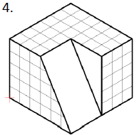 |
| Cubo con corte por plano inclinado |  

Vamos a partir del cubo compleeto para hacer el corte de forma diferente, es decir, como cada cuadradito mide 10mm el cubo tiene unas dimensiones de 60x60x50 mm que vamos a dibujar a partir de un boceto de 60x60 sobre el plano XY situado en el primer cuadrante y con un vértice en el origen de coordenadas de referencia. Este boceto lo extruiremos en positivo 50 mm para obtener el cubo que vemos en la imagen 2.

| Imagen 2 |
|:-:|  
| 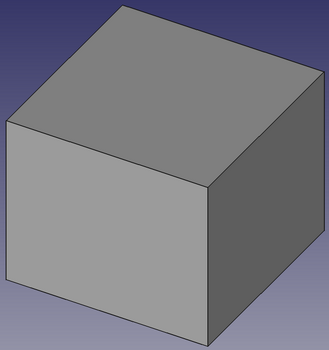 |
| Cubo de 60x60x50 |  

Vamos ahora a realizar un corte a la pieza utilizando para ello un plano de referencia. Este plano lo usamos como soporte para hacer un boceto, es decir, algo similar a lo que hacemos cuando seleccionamos una cara como soporte de un boceto. El icono que nos da acceso a la herramienta es el que vemos en la imagen 3.

| Imagen 3 |
|:-:|  
| 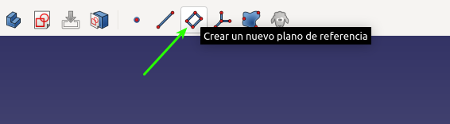 |
| Icono acceso a plano de referencia |  

Una vez seleccionada la herramienta se muestra una ventana como la de la imagen 4.

| Imagen 4 |
|:-:|  
| 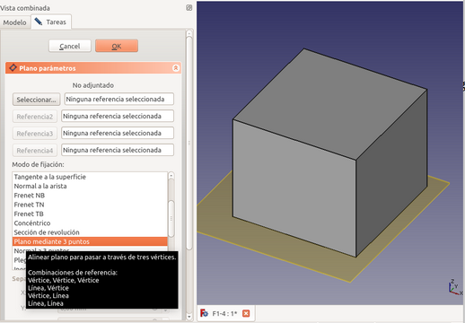 |
| Herramienta plano de referencia |  

Vemos que existen diversas formas de fijar un plano de referencia y que si dejamos el cursor sobre alguna de ellas nos muestra información adicional de lo que podemos hacer. En nuestro caso vamos a definir un plano que pasa por tres puntos, luego necesitamos definir esos tres puntos en nuestro sólido.

Para crear puntos de referencia disponemos de una herramienta que podemos desplegar haciendo clic sobre el icono que vemos en la imagen 5.

| Imagen 5 |
|:-:|  
| 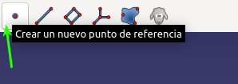 |
| Icono acceso a crear puntos de referencia |  

Esto nos despliega una ventana en la que disponemos de diversas opciones. Nosotros vamos a utilizar la opción *Vértice* que es la que observamos en la imagen 6.

| Imagen 6 |
|:-:|  
| 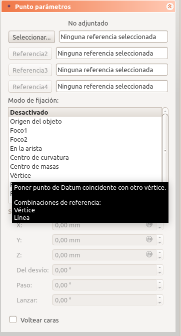 |
| Fijar punto de referencia a vértice |  

En nuestro caso vamos a comenzar por seleccionar el vértice de la imagen 7.  

| Imagen 7 |
|:-:|  
| 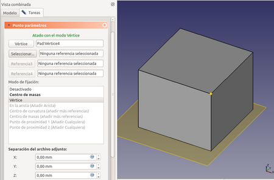 |
| Selección de vértice |  

Vamos a situar el punto a 30 mm del vértice seleccionado para que quede como vemos en la imagen 8.

| Imagen 8 |
|:-:|  
| 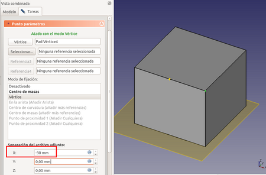 |
| Desplazamiento del punto de referencia |  

Antes de añadir otro punto hacemos clic en el botón OK para cerrar la tarea y posteriormente procedemos a situar otros dos puntos como vemos en las imágenes 9a y 9b.

| Imagen 9a | Imagen 9b |
|:-:|:-:|  
| 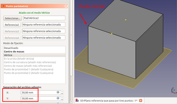 |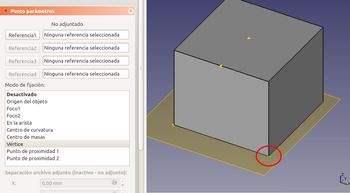 |
| Fijación del segundo punto | Fijación del tercer punto  |

Ya tenemos los tres puntos por donde debe pasar el plano, que quedan por defecto nombrados como vemos en la imagen 10.

| Imagen 10 |
|:-:|  
| 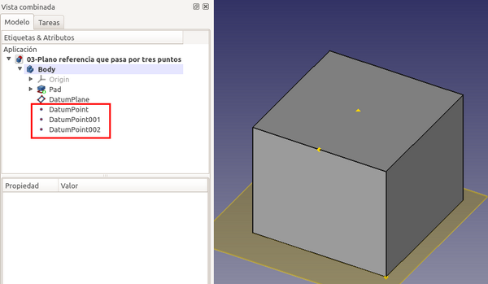 |
| Nombres asignados a los puntos de referencia |  

Vamos a proceder ahora a definir ese plano, para lo que seleccionamos la herramienta correspondiente, escogemos plano por tres puntos y haciendo clic en los botones asociados vamos seleccionando cada uno de los puntos realizando un zoom de acercamiento si es necesario. Si clicamos por error en una cara por ejemplo, simplemente volvemos a hacer clic sobre el punto y se actualiza la selección. El aspecto final debe ser el de la imagen 11.

| Imagen 11 |
|:-:|  
| 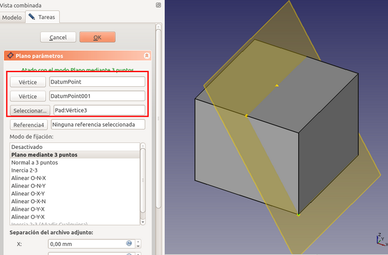 |
| Definición del plano que pasa por tres puntos |  

Ahora que tenemos el plano ya podemos utilizarlo para crear nuestro boceto, pero la idea es que este sea una línea cerrada que pasa por los tres puntos que definen el plano, por tanto lo más conveniente va a ser crear una proyección auxiliar de esos tres puntos puesto que ellos mismos no van a ser seleccionables como referencia para los vértices de nuestro boceto. Seleccionamos el plano haciendo un clic sobre el mismo y creamos un nuevo boceto. Sin finalizar la tarea nos dirigimos a la ventana *Vista combinada* y hacemos clic en *Modelo* para ocultar el plano y poder trabajar más cómodamente y cuando lo hagamos volvemos a la vista *Tareas*. En la imagen 12 observamos esto.

| Imagen 12 |
|:-:|  
| 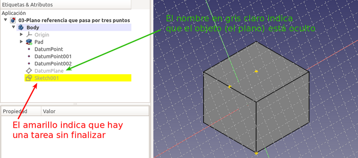 |
| Ocultar plano sin finalizar tarea |  

Escogemos la herramienta de crear arista vinculada, tal y como se observa en la imagen 13, y creamos una proyección de los tres puntos.

| Imagen 13 |
|:-:|  
| 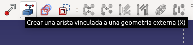 |
| Herramienta arista vinculada |  

Ahora dibujamos una polilínea que pase por esos tres puntos para obtener un boceto que delimite una superficie y como podemos observar las líneas están en verde indicando que está totalmente restringido ya que lo están los tres puntos que definen sus vértices. El aspecto debe ser el de la imagen 14.

| Imagen 14 |
|:-:|  
| 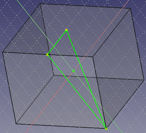 |
| Boceto que delimita una superficie |  

Se ha puesto una transparencia del 80% al único Body existente para facilitar la visualización de la línea que va por el interior del sólido.

Con este nuevo boceto ya podemos trabajar de la forma habitual, por ejemplo haciendo un vaciado invertido, obteniendo algo similar a lo que vemos en la imagen 15.

| Imagen 15 |
|:-:|  
| 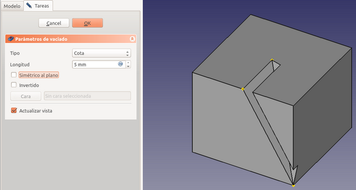 |
| Vaciado invertido |  

Si aumentamos la cota podemos llegar a cortar totalmente el cubo. También podemos hacer un vaciado invertido y ver que ocurre. Estos efectos los vemos en las imágenes 16a y 16b.

| Imagen 16a | Imagen 16b |
|:-:|:-:|
| 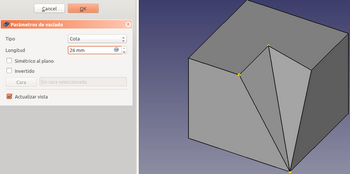 |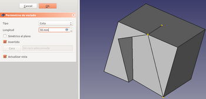 |
| Efecto de aumentar el valor de cota | Aumentar cota con vaciado invertido |

Aumentar la cota se puede sustituir cambiando el *Tipo* por *A través de todos*. Esta situación es ideal para explicar el funcionamiento paramétrico de FreeCAD. Para ello vamos a hacer algunas modificaciones en el objeto y vemos que ocurre.

1. Cambiamos la longitud de extrusión del boceto original de 5 cm a 3cm y tendremos algo como lo que vemos en la imagen 17. Vemos que el plano ha cambiado a la nueva posición y esto es debido a que los puntos por donde pasa están asociados a los vértices del sólido y por tanto si el sólido mueve esos vértices el plano se mueve con ellos.

| Imagen 17 |
|:-:|  
| 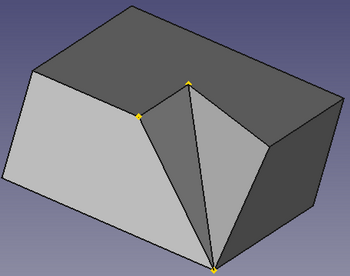 |
| Cambio en la longitud de extrusión |  

2. Otra situación es la que vemos en la imagen 18, donde hemos cambiado de posición de dos de los puntos de referencia del plano y con ello cambia el vaciado creado en el sólido. Incluso un punto lo hemos sacado del sólido.

| Imagen 18 |
|:-:|  
| 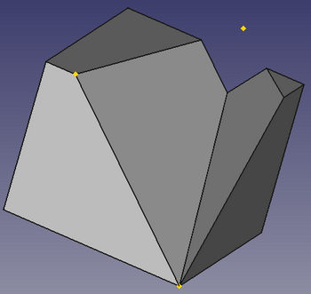 |
| Cambio de posición de los puntos de referencia |  

Por ahora dejamos la pieza tal y como la habíamos diseñado inicialmente.
La pregunta ahora sería ¿se puede diseñar la pieza propuesta inicialmente por este método sin añadir complejidad? Pues la respuesta es que si, lo único que hace falta es agregar un cuarto punto en el lugar adecuado y repetir todo el proceso anterior con los cuatro puntos y tendremos diseñada la pieza tal cual estaba propuesta, que podemos ver en la imagen 19. También la tenenmos resuelta en este [enlace](../Ejercicios/src/03/03-plano-tres-puntos.FCStd).

| Imagen 19 |
|:-:|  
| 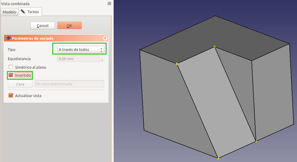 |
| Plano de referencia que pasa por cuatro puntos |  

