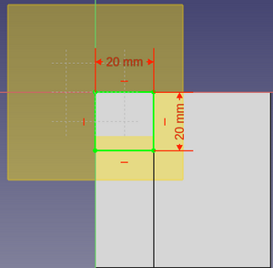

# Plano de referencia fijado a objetos

Vamos a explicar como crear planos de referencia fijados a los objetos denominados “Plano XY, Plano XZ y Plano ZY” representados en la imagen 1. Ya hemos vistos que cuando creamos un cuerpo o body se crea un elemento denominado “Origin” que contiene los tres planos y los tres ejes de referencia del sistema de coordenadas.

| Imagen 1 |
|:-:|  
|  |
| Planos de referencia |  

Si hacemos clic en crear un nuevo plano de referencia, esto va a mostrar por defecto un plano en el de referencia XY y se abrirá la ventana de parámetros para seleccionar y con los modos de fijación, pero lógicamente sin tener ninguna referencia seleccionada, como vemos en la imagen 2.

| Imagen 2 |
|:-:|  
|  |
| Ventana de parámetros plano de referencia |  

Si dejamos el cursor, por ejemplo, sobre la opción de “Objetos de XY” se mostrarán los tipos de fijación que estarán disponibles y que vemos en la imagen 3.

| Imagen 3 |
|:-:|  
|  |
| Tipos de fijación disponibles |  

Si en esta situación cerramos la tarea clicando en OK se nos mostrará una advertencia como la que vemos en la imagen 4.

| Imagen 4 |
|:-:|  
|  |
| Creación de plano de referencia inamovible |  

Si hacemos clic en “Yes” se nos crea un plano en XY pero que estará fijado al plano XY de referencia y no podremos moverlo, como vemos en la imagen 5.

| Imagen 5 |
|:-:|  
|  |
| Plano re referencia fijado al de referencia XY |  

Vamos a repetir la operación de crear un plano de referencia pero esta vez vamos a seleccionar uno de los planos de referencia del sistema y podemos observar como el plano que se va a crear queda atado al plano de referencia seleccionado y además con valores de movimiento editables, como se observa en la imágen 6.

| Imagen 6 |
|:-:|  
|  |
| Plano re referencia **movible** fijado al de referencia |  

Pues bien, lo que vamos a ver a continuación es como fijar el plano de referencia a “Objetos de XY, de XZ o de YZ”. Como inicio vamos a diseñar la pieza número 3 de las fichas de referencia utilizando un plano de referencia para ello. El aspecto de la figura a diseñar en la ficha es el de la imagen 7.

| Imagen 7 |
|:-:|  
|  |
| Pieza número 3 de la ficha 1 a diseñar |  

Realizamos un croquis sobre el plano XZ de las dimensiones que vemos en la imagen 8a y lo extruimos 60 mm para obtener algo similar a lo de la imagen 8b.

| Imagen 8a | Imagen 8b |
|:-:|:-:|
|  |  |
| Croquis inicial pieza 3 - ficha 1 | Pieza 3 - ficha 1 inicial |  

Para crear el trozo que falta vamos a utilizar un plano que crearemos seleccionado el plano XY de referencia y que desplazaremos 60mm en el eje Z para situarlo a la altura del rectángulo superior. Esto lo vemos en la imagen 9. Es evidente que se puede hacer creando el croquis directamente sobre la cara, pero para ver el funcionamiento de este tipo de planos resulta perfectamente válido.

| Imagen 9 |
|:-:|  
|  |
| Plano de referencia fijado a XY desplazado |  

Seleccionando el plano creado y clicamos en boceto para tener uno nuevo como vemos en la imagen 10.

| Imagen 10 | |
|:-:|:-:|  
|  |  |
| Boceto con dimensiones | Boceto finalizado |

Simplemente queda extruirlo y tenemos finalizada la pieza con una parte creada a partir de un plano de referencia, tal y como vemos en la imagen 11.

| Imagen 11 |
|:-:|  
|  |
| Pieza 3 - ficha 1 finalizada |  

Es evidente que esta misma situación podemos conseguirla de otras formas incluso más sencillas, pero la ventaja que tiene hacerlo mediante un plano es que el trozo creado puede recibir tareas independiente del objeto global relativas por ejemplo a la orientación del plano. En la imagen 12 vemos como hemos rotado el plano en dos ejes y como lo hace la figura.

| Imagen 1 |
|:-:|  
|  |
|  |  

