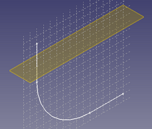

# Repaso extrusión por barrido y plano de referencia normal

## Repaso extrusión por barrido

En primer lugar vamos a hacer el diseño de un solido utilizando el sistema de barrido de croquis. Vamos a crear un codo de tubo con sección hexagonal como el que vemos en la imagen 1.

| Imagen 1 |
|:-:|  
|  |
| Codo a diseñar |  

Para ello vamos a comenzar por crear un nuevo archivo y un boceto en el plano YZ que nos va a marcar la trayectoria de extrusión y las dimensiones del codo. Debe quedar como vemos en la imagen 2. Una vez finalizado el boceto cerramos la tarea.

| Imagen 2 |
|:-:|  
|  |
| Boceto en plano YZ para la trayectoria |  

Creamos un nuevo boceto en el mismo body (lo seleccionamos como activo si es necesario) ahora en el plano XZ. Será un hexágono con su centro en el origen de coordenadas y un circulo con centro en el mismo lugar de las dimensiones que vemos en la imagen 3. Una vez finalizado el boceto cerramos la tarea.

| Imagen 3 |
|:-:|  
|  |
|  |  

La situación que debemos tener es la de la imagen 4.

| Imagen 4 |
|:-:|  
|  |
| Situación con los dos bocetos |  

Seleccionamos la herramienta de barrido de croquis, la de la imagen 5

| Imagen 5 |
|:-:|  
|  |
| Herramienta barrido |  

Esto nos despliega la ventana de la imagen 6. Vemos como el objeto es el “Sketch001” y debemos hacer clic en la secuencia que se indica.

| Imagen 6 |
|:-:|  
|  |
| Ventana para selecciones de barrido |  

Nos aparece de forma inmediata el objeto final tal y como observamos en la imagen 7.

| Imagen 7 |
|:-:|  
|  |
| Resultado de la selección de la imagen 6 |  

Si cerramos la tarea haciendo clic en el botón OK veremos el trabajo terminado (imagen 8) y se observa el efecto del boceto creado para extruir con la forma hexagonal exterior y el orificio circular interior realizados a un tiempo, aunque es evidente que se puede hacer de otras formas esta parece bastante eficaz y no requiere de orificio posterior.

| Imagen 8 |
|:-:|  
|  |
| Codo hexagonal final por barrido |  

## Herramienta espesor

Vamos a ver el proceso para hacer lo mismo utilizando la herramienta de “Aplicar espesor” que resulta también muy interesante. Está disponible en el menú “Part” y la vemos en la imagen 9.

| Imagen 9 |
|:-:|  
|  |
| Herramienta espesor |  

Partimos de la situación que vemos en la imagen 10, donde observamos que el orificio circular está eliminado.

| Imagen 10 |
|:-:|  
|  |
| Situación de partida para herramienta espesor |  

Aplicamos una extrusión por barrido del boceto hexagonal siguiendo la trayectoria curva y obtenemos el sólido que vemos en la imagen 11.

| Imagen 11 |
|:-:|  
|  |
| Extrusión por barrido perfil hexagonal |  

Ahora nos situamos en el menú “Part”, seleccionamos una cara hexagonal del sólido y hacemos clic en la herramienta espesor citada, vemos como se nos crea el objeto tubo de forma inmediata. Podemos jugar con las diferentes opciones para ver como funcionan. En la imagen 12 vemos una solución que consiste en hacer clic en el botón “Caras” y posteriormente clic en ambas caras hexagonales para seleccionarlas.

| Imagen 12 | |
|:-:|:-:|   
|  | |
| Espesor entre caras: selección | Espesor entre caras: resultado | 

## Plano de referencia normal a una arista

Vamos a trabajar con el plano normal, que tiene como selecciones válidas las que vemos en la imagen 13. Vamos a obtener el mismo objeto que estamos viendo pero utilizando planos de referencia, en este caso plano de referencia normal a una arista.

| Imagen 13 |
|:-:|  
|  |
| Selecciones válidad en plano normal a una arista |  

Si queremos agilizar un poco el tiempo, el archivo creado anteriormente lo podemos copiar y renombrar y así podemos partir del primer boceto ya finalizado eliminando el resto de tareas realizadas.

Vamos a crear un plano normal a una arista, y esta va a ser la trayectoria de extrusión creada en el plano YZ, luego la situación de partida va a ser la que vemos en la imagen 14.

| Imagen 14 |
|:-:|  
|  |
| Trayectoria de partida |  

Con la arista seleccionada desde vista 3D como en la imagen 15 hacemos clic en crear plano de referencia.

| Imagen 15 |
|:-:|  
|  |
| Selección de arista (trayectoria) en vista 3D y creación de plano |  

Se mostrará una ventana como la de la imagen 16, donde escogemos “Normal a arista” y donde observamos que hay seleccionada una arista. También podemos ver el plano que vamos a crear.

| Imagen 16 |
|:-:|  
|  |
| Escogemos opción para el plano |  

Una vez hacemos clic en “OK” el aspecto del plano creado lo vemos en la imagen 17.

| Imagen 17 |
|:-:|  
|  |
| Aspecto del plano |  

En la parte inferior de la ventana de tareas del plano tenemos algunas opciones que afectan a la posición y orientación del plano. En las imágenes 18 vemos como hacer un desplazamiento sobre su vector. En este caso la dirección del vector es la positiva del eje Z respecto a los ejes de referencia y por eso la cota es negativa.

| Imagen 18 |  |
|:-:|:-:|
|  |  |
| Opciones de posición del plano | Efecto en la vista 3D |

Si necesitamos cambiar ese valor a positivo (cambiara la dirección del vector) debemos marcar la opción “Voltear caras”, como vemos en las imágenes 19 donde se observa como el mismo valor desplaza al plano justo en la dirección opuesta.

| Imagen 19 |  |
|:-:|:-:|
|  |  |
| Opciones de posición del plano | Efecto en la vista 3D |

Ya estamos en condiciones de crear el mismo boceto que anteriormente, en cualquiera de las formas vistas, para realizar una extrusión por trayectoria. Si seleccionamos el plano de referencia y creamos un nuevo boceto tendremos la situación que vemos en la imagen 20.

| Imagen 20 |
|:-:|  
|  |
| Realización de boceto sobre plano creado |  

Creamos el nuevo boceto como el que podemos ver en la imagen 3. Una vez finalizado el boceto aplicamos la extrusión por barrido vista anteriormente y tendremos la situación que vemos en la imagen 21.

| Imagen 21 |
|:-:|  
|  |
| Barrido por trayectoria |  

Si cerramos la tarea y ocultamos e plano de referencia tenemos el resultado final que vemos en la siguiente 22.

| Imagen 22 |
|:-:|  
|  |
| Aspecto final del objeto 3D |  

## Centro de masas de una arista

Vamos a ver como situar el plano en el centro de masas de la arista. Para ello creamos un punto en el centro de masas, como vemos en la imagen 23.

| Imagen 23 |
|:-:|  
|  |
| Situar plano en centro de masas de arista |  

Ahora tan solo debemos crear el plano y hacer clic en el punto creado y el plano se creará normal a la arista y situado en su centro de masas, como vemos en la imagen 24.

| Imagen 24 |
|:-:|  
|  |
| Creación de plano a partir de punto en centro de masas |  

A partir de este plano ya podemos trabajar de cualquieras de las formas descritas para crear un boceto que tenga como base ese plano.

Para ver mejor la aplicación de esto vamos a partir de una pieza basada en un boceto como el de la imagen 25a que extruiremos 10mm para que quede como en la imagen 25b.

| Imagen 25a | Imagen 25b |
|:-:|:-:| 
|  |  |
| 25a. Boceto de partida | 25b. Aspecto final |  

La idea es hacer un taladro centrado en la cara curva que atraviese toda la pieza. Inicialmente podríamos pensar en seleccionar la cara y clicar en crear boceto, pero esto no va a funcionar y FreeCAD nos va a mostrar el mensaje de error que vemos en la imagen 26.

| Imagen 26 |
|:-:|  
|  |
| Error por selección cara curva como referencia |  

Indicándonos de forma muy clara que un boceto no se puede realizar sobre una cara curva.

Vamos a crear un punto en el centro de masas de la parte curva de la pieza, para lo cual seleccionamos la cara y hacemos clic en crear punto, escogiendo centro de masas, tal y como vemos en la imagen 27.

| Imagen 27 |
|:-:|  
|  |
| Crear punto en centro de masas de cara curva |  

En la imagen 28 observamos que en este caso el centro de masas de esa cara curva está fuera de la pieza a la que pertenece.

| Imagen 28 |
|:-:|  
|  |
| Posición del centro de masas en cara curva |  

A continuación vamos a crear un punto de referencia en cada una de las aristas rectas que situaremos en su centro de masas, tal y como se observa en la imagen 29.

| Imagen 29 |
|:-:|  
|  |
| Creación de mas puntos en centros de masas de aristas |  

Ahora creamos el plano que pasa por tres puntos haciendo clic en uno de los puntos de una arista, en segundo lugar en el punto de la otra arista y en tercer lugar en el punto que representa el centro de masas de la curva y escogemos normal a tres puntos, obteniendo el plano que vemos en la imagen 30. Durante el proceso observamos que FreeCAD va intentando dar soluciones según las selecciones que vamos haciendo.

| Imagen 30 |
|:-:|  
|  |
| Plano normal a los tres puntos |  

Ahora podemos hacer el boceto del taladro pasante que estamos buscando situándolo sobre el plano recién creado, tal y como observamos en la imagen 31.

| Imagen 31 |
|:-:|  
|  |
| Creación de boceto para taladro sobre el plano creado |  

Vamos a hacer una sencilla comprobación de que el centro del taladro va a estar en el centro esperado y para ello vamos a utilizar los iconos que se explican a continuación.

 

Crear una arista vinculada a una geometría externa. Con esto crearemos dos líneas auxiliares (aparecerán en azul) vinculadas a las aristas rectas de la cara curva. 

Cambiar la barra de herramientas a las restricciones seleccionadas a/desde el modo de referencia. Con esto crearemos cotas constructivas que no crearán ningún conflicto con las dimensiones reales de la pieza. Tanto la barra de herramientas como las cotas creadas se pondrán en azul indicando que son auxiliares. 

Si realizamos las acotaciones que vemos en la imagen 32 podemos observar como efectivamente el centro del agujero va a estar situado en el centro de masas.

| Imagen 32 |
|:-:|  
|  |
| Acotaciones para comprobar centro de masas |  

Una vez cerrada la tarea anterior hacemos clic en crear vaciado y procedemos según vemos en la imagen 33.

| Imagen 33 |
|:-:|  
|  |
| Creación del taladro mediante vaciado |  

El resultado final lo podemos observa en la animación que vemos a continuación en la que se han ocultado tanto los puntos como el plano creados.

  

