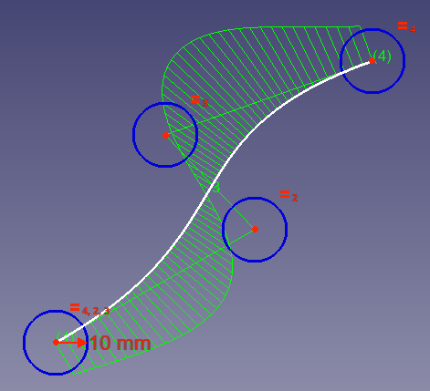

# Búsqueda de ejes locales en superficies planas y superficies curvas

## Splines

En esta ocasión vamos a aprender algo más sobre las splines y comenzaremos por dar una breve definición de lo que son. En wikipedia podemos leer “El término "spline" hace referencia a una amplia clase de funciones que son utilizadas en aplicaciones que requieren la interpolación de datos, o un suavizado de curvas”.

Existen dos opciones de creación splines que son:

| | Dibuja una curva B-spline (spline básica) a través de sus puntos de control |
| | Dibuja una curva B-spline periódica (cerrada) a través de sus puntos de control |

En la imagen 1 vemos una spline trazada y vamos a analizar los elementos que la componen.

| Figura 1 |
|:-:|
|  |
| Spline de cuatro puntos |

